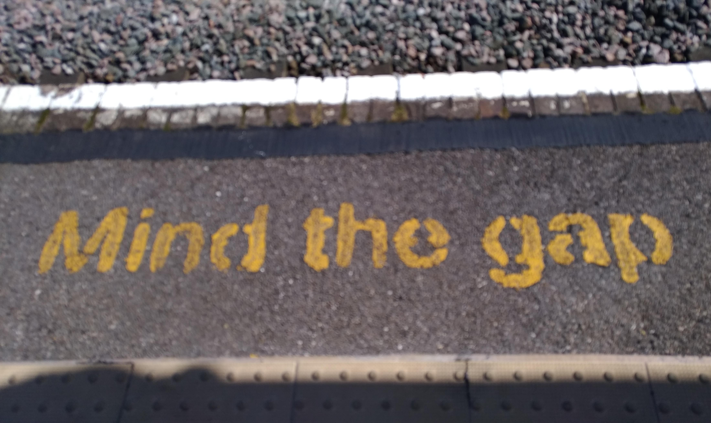

# Mind the Gaps

[](https://doi.org/10.5281/zenodo.14600069)

Gaussian Processes time series modelling with focus on period detection on irregularly-sampled stochastically-varying astronomical time series



The method effectively combines Gaussian Process modelling with the likelihood ratio test outline in [Protassov et al. 2002](https://ui.adsabs.harvard.edu/abs/2002ApJ...571..545P/abstract). At present, the code uses the **celerite** kernels proposed by [Foreman-Mackey et al. 2017](https://iopscience.iop.org/article/10.3847/1538-3881/aa9332)


## Installation
To install the repository, first clone to your computer:
```shell
`git clone https://github.com/andresgur/mind_the_gaps`
```

Then enter the `mind_the_gaps` main directory, and pip install it by running:
```
pip install .
```

## Usage

> # Warning
> Users are welcome to use/test the code and provide feedback but beware, the code is still in alpha phase, so expect bugs, errors and crashes! If you are intending to use the code, my recommendation would be to get in touch first!


The code can be used as a standalone to generate lightcurves or as it is designed for, to test for a periodicity in a lightcurve. At a minimum your lightcurve should have timestamps, rates, uncertainties and exposures, and it can also contain background rates and uncertainties on the background. I suspect the simulator is more powerful than anything out there, as it allows to chose the type of noise (Gaussian, Poissonian or Kraft) and simulate with any given observing window (regular or otherwise). Moreover, as opposed to some codes out there, the variance and the mean are also randomized in each simulation.

When it comes to attempting to detect a periodicity, 
usually the first task is to identify the null hypothesis (a stochastic-only model) and the alternative model, 
which contains the periodic component (stochastic model + periodic component). 
To see how to go about model selection, see the notebook in [tutorials](docs/notebooks/). 
Once you've established these two (note you can also have several sets of null hypothesis and alternative model) we follow the method outlined by [Protassov et al. 2002](https://ui.adsabs.harvard.edu/abs/2002ApJ...571..545P/abstract)

1. Fit the observed data using the two null and alternative models
2. Generate lightcurves from the posteriors of the stochastic model
3. Fit the generated lightcurves using both models
4. Build a histogram of the fit-improvements (LRT) found for the simulated lightcurves and check where the value observed in the data falls in the histogram. An outlier (say p<0.05) suggest the fit-improvement observed in the data is highly unlikely. High p-values indicate the fit-improvement is simply due to noise.

Another notebook in [tutorials](docs/notebooks/) shows how to implement this process using functions and objects from the package.


## Tests
Tests are included in the `tests/` directory. 
To install the test prerequisites, install the code as:
```shell
pip install .[test]
```
Tests can then be run using:
```shell
pytest
```

## Citation

You can cite the [paper](https://academic.oup.com/mnras/advance-article/doi/10.1093/mnras/staf196/7994434) or the code as given below:

```bibtex
@article{10.1093/mnras/staf196,
    author = {Gúrpide, Andrés and Middleton, Matthew},
    title = {Mind the gaps: improved methods for the detection of periodicities in unevenly-sampled data},
    journal = {Monthly Notices of the Royal Astronomical Society},
    pages = {staf196},
    year = {2025},
    month = {01},
    abstract = {The detection of periodic signals in irregularly-sampled time series is a problem commonly encountered in astronomy. Traditional tools used for periodic searches, such as the periodogram, have poorly defined statistical properties under irregular sampling, which complicate inferring the underlying aperiodic variability used for hypothesis testing. The problem is exacerbated in the presence of stochastic variability, which can be easily mistaken by genuine periodic behaviour, particularly in the case of poorly sampled lightcurves. Here we present a method based on Gaussian Processes (GPs) modelling for period searches and characterization, specifically developed to overcome these problems. We argue that in cases of irregularly-sampled time series, GPs offer an appealing alternative to traditional periodograms, because the known distribution of the data (correlated Gaussian) allows a well-defined likelihood to be constructed. We exploit this property and draw from existing statistical methods to perform traditional likelihood ratio tests for an additional, (quasi-)periodic component, using the aperiodic variability inferred from the data as the null hypothesis. Inferring the noise from the data allows the method to be fully generalizable, with the only condition that the data can be described as a Gaussian process. We demonstrate the method by applying it to a variety of objects showing varying levels of noise and data quality. Limitations of the method are discussed and a package implementing the proposed methodology is made publicly available.},
    issn = {0035-8711},
    doi = {10.1093/mnras/staf196},
    url = {https://doi.org/10.1093/mnras/staf196},
    eprint = {https://academic.oup.com/mnras/advance-article-pdf/doi/10.1093/mnras/staf196/61722589/staf196.pdf},
}
```

```bibtex
@software{andres_gurpide_lasheras_2024_14253754,
  author       = {Andrés Gúrpide Lasheras and
                  Sam Mangham},
  title        = {{andresgur/mind\_the\_gaps: Release for paper}},
  month        = jan,
  year         = 2025,
  publisher    = {Zenodo},
  version      = {v1.2.0-beta},
  doi          = {10.5281/zenodo.14600069},
  url          = {https://doi.org/10.5281/zenodo.14600069}
}
```
